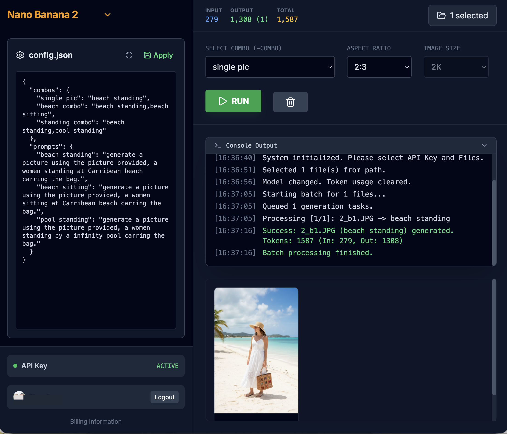

## Features

* Support Nano Banana 2 and 3 

* Select 1 input picture as reference

* Define prompts in json, and generate a combo of them

* Google (firebase) authentication

* Simple authorization (if email is in list)

* Shows token used and cost respectively under Nano Banana 2 and 3 

  




## Setup Firebase

### Firebase project config

1. **Go to the [Firebase Console](vscode-file://vscode-app/Applications/Visual Studio Code.app/Contents/Resources/app/out/vs/code/electron-browser/workbench/workbench.html)**.

2. Click **"Add project"** and create a new project (e.g., "BananaPicGen").

3. Once created, click the **+Add App** --> **Web icon (`</>`)** to register your app.

4. Copy the `firebaseConfig` object provided (it looks like `const firebaseConfig = { ... }`). Make the json in 1 line.

5. For local, put under .env.local. For online deployment, add it its environment vars

   

### Enable Google authentication in firebase

* Enable Google in **Authentication -> Sign-in Method**
* Add Domain (localhost is by default there) in **Authentication -> Settings -> Authorized domains**


### Firebase Database for user list

* Start collection **config**

* Add document **access**

* Add **array ** field "allowedEmails" with your allowed emails

* Allow read access in Rules
  ```
  rules_version = '2';
  
  service cloud.firestore {
    match /databases/{database}/documents {
      match /{document=**} {
        allow read: if request.auth != null;
      }
    }
  }
  ```

  


## Run Locally

**Prerequisites:**  Node.js


1. Install dependencies:
   `npm install`
2. Set the `GEMINI_API_KEY` and `FIREBASE_CONFIG` in [.env.local](.env.local)
3. Run the app:
   `npm run dev`


## Run from docker

```
# Build the image (no API key needed here)
docker build -t banana-pic-gen .

# Run the container with the API key
docker run -e GEMINI_API_KEY=your_actual_api_key -FIREBASE_CONFIG=firebase_json -p 8080:80 banana-pic-gen
```